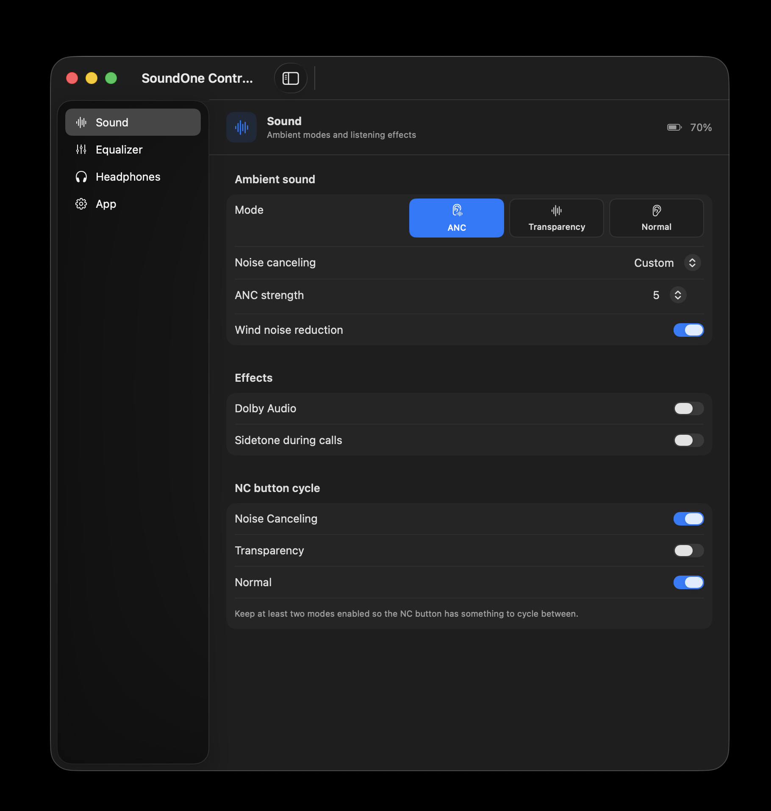

# SoundOne Control

An unofficial, native macOS menu-bar controller for Soundcore Space One Pro (A3062) headphones.

SoundOne Control talks directly to the headphones over Bluetooth. It is local-only, has no telemetry, and does not require the Soundcore phone app after the headphones have been paired once.



## Features

- Menu-bar battery, ambient-mode, EQ-preset, and Dolby controls
- Noise Canceling, Transparency, and Normal modes
- Adaptive/custom ANC, ANC strength, transparency strength, and wind reduction
- All factory EQ presets and an accessible eight-band custom equalizer
- Dolby Audio and sidetone
- Automatic power-off and high-volume protection
- NC-button BassUp action and configurable ambient-mode cycle
- Multipoint enablement, remembered devices, connect/disconnect, and forget actions
- Automatic reconnect, optional launch at login, and connection/low-battery notifications
- Global shortcuts:
  - `⌥⌘A` cycles ambient mode
  - `⌥⌘D` toggles Dolby Audio
  - `⌥⌘E` applies the selected favorite EQ preset

The menu-bar icon is visible only while the headphones are connected.

## Requirements

- macOS 15 or newer
- Soundcore Space One Pro (A3062), already paired in System Settings
- Xcode 16 or newer to build from source

Soundcore permits only one active settings controller. Fully close the Soundcore phone app if SoundOne Control cannot open the control channel. Audio multipoint can remain enabled.

## Build and run

```sh
git clone https://github.com/amanamisrael/SoundOneControl.git
cd SoundOneControl
./scripts/build-app.sh
open "dist/SoundOne Control.app"
```

The build script creates a release build, assembles an app bundle, and applies an ad-hoc signature. An Apple Developer account is not required for local source builds. macOS may ask for Bluetooth and notification permission on first launch.

Run the checks with:

```sh
swift test
swift build -c release
```

## Architecture

- `SoundOneControl` is the SwiftUI/AppKit menu-bar application.
- `SoundOneBluetoothAgent` is a bundled, short-lived helper that owns the legacy RFCOMM channel. It starts only when needed and communicates with the app through private pipes. It is not a daemon and has no network access.
- The A3062 packet model and command generation are independent of UI and transport code and covered by unit tests.
- The headphones are always treated as the source of truth. Changes are acknowledged and followed by a fresh state read; failed changes roll back in the UI.

The helper boundary exists because current macOS releases can deadlock IOBluetooth RFCOMM channel creation after AppKit has taken over the main run loop. Opening the channel in the helper keeps reconnects reliable without blocking the menu app.

## Deliberate exclusions

- Firmware updates remain in Soundcore's official mobile app. A failed unofficial update could brick the headphones.
- LDAC is shown as an Android-only capability because macOS does not provide LDAC playback for this model.
- Wear detection is not shown because A3062 firmware does not expose a verified command for it.
- Voice-prompt controls are intentionally omitted.

## Attribution and license

The Soundcore A3062 protocol implementation is based on the reverse-engineering work in [OpenSCQ30](https://github.com/Oppzippy/OpenSCQ30). SoundOne Control is licensed under GPL-3.0-or-later; see [LICENSE](LICENSE).

Soundcore and Anker are trademarks of their respective owners. This project is not affiliated with or endorsed by Soundcore or Anker. The SoundOne Control icon and interface are original work and do not use Soundcore app assets.
